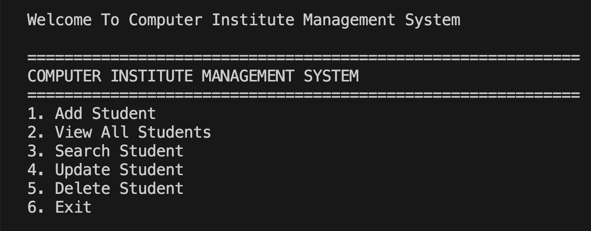
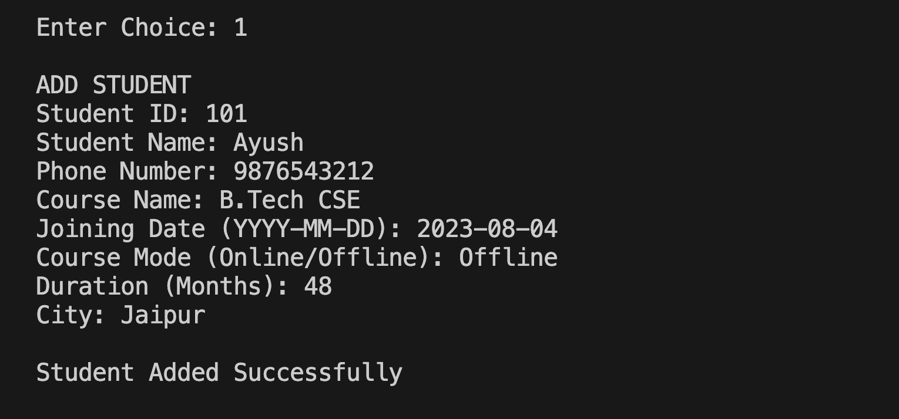
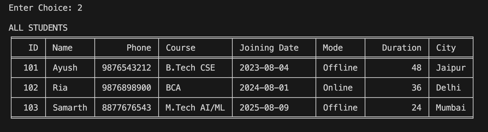
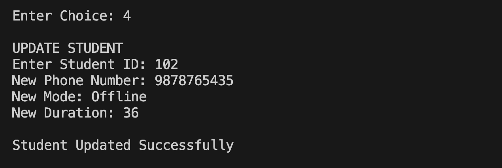
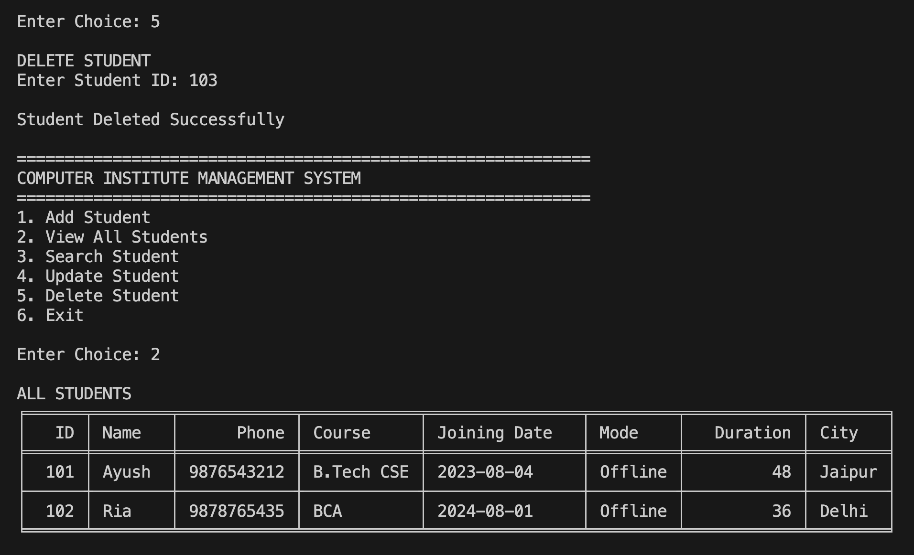

# Computer Institute Management System (CIMS)

A command-line based management system built using Python and SQLite for handling student records in a computer institute.

## Features
- Add student records
- View all students
- Search student by ID
- Update student details
- Delete student records
- SQLite database integration
- Tabular data display using tabulate

## Technologies Used
- Python
- SQLite
- Tabulate

## Project Structure
- `main.py` → Main application
- `cims.db` → SQLite database
- `screenshots/` → Project screenshots

## Future Improvements
- GUI version using Tkinter
- Flask web version
- Authentication improvements
- Student fee management system
- Attendance tracking system

## Screenshots

### Main Menu

### Add Student

### View All Students

### Update Record

### Delete Record
