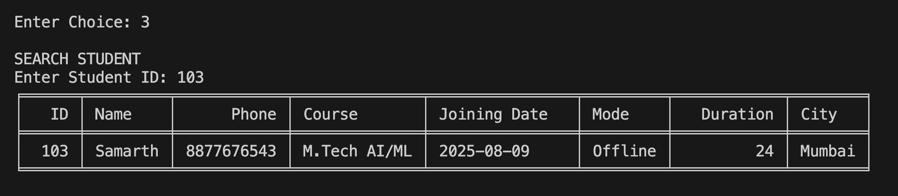

# Computer Institute Management System (CIMS)

A command-line based management system built using Python and SQLite for handling student records in a computer institute.

## Features
- Add student records
- View all students
- Search student by ID
- Update student details
- Delete student records
- SQLite database integration
- Tabular data display using tabulate
- Login authentication system

## Technologies Used
- Python
- SQLite
- Tabulate

## Project Structure
- `main.py` → Main application
- `cims.db` → SQLite database
- `screenshots/` → Project screenshots

## How to Run

Install required package:

```bash
pip install tabulate
```

Run the project:

```bash
python3 main.py
```

## Screenshots

### Main Menu


---

### Insert Student Record


---

### Search Student Record


---

### View All Records


---

### Update Student Record


---

### Delete Student Record


## Future Improvements
- GUI version using Tkinter
- Flask web version
- Attendance management system
- Student fee management
- Export records to CSV/PDF

## Author
Aarushi Singh